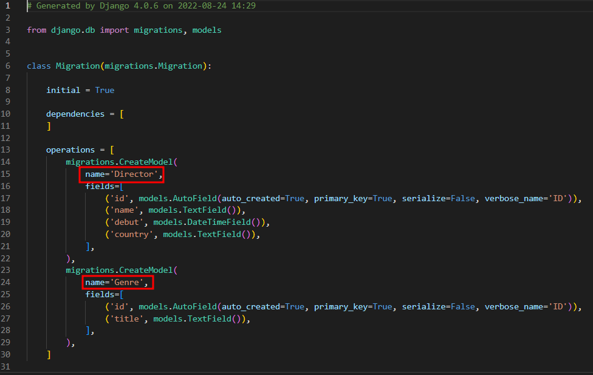

# 8/24

# [DB] ORM 📝

## **ORM** 💭

- **Object-Relational-Mapping**
- 객체 지향 프로그래밍 언어를 사용하여 호환되지 않는 유형의 **시스템 간의 데이터를 변환하는 프로그래밍 기술**
- 파이썬에는 SQLAlchemy, peewee 등 라이브러리가 있으며 Django 프레임워크에서는 내장 Django ORM을 활용

**객체(Object)로 DB를 조작한다💡**

<br/>

## **모델 설계 및 반영**

**클래스를 생성하여 내가 원하는 DB의 구조를 만든다.**

```py
class Genre(models.Model):
  name = models.CharField(max_length=30)
```

**클래스의 내용으로 데이터베이스에 반영하기 위핸 마이그레이션 파일을 생성한다.**

```py
class Genre(models.Model):
  name = models.CharField(max_length=30)

python manage.py(파일명) makemigrations
```

**DB에 migrate 한다.**

```py
python manage.py migrate
```

## **Migration(마이그레이션)💡**

- Model에 생긴 변화를 DB에 반영하기 위한 방법
- 마이그레이션 파일을 만들어 DB 스키마를 반영한다.
- 명령어
  - makemigrations: 마이그레이션 파일 생성
  - migrate: 마이그레이션을 DB에 반영

```py
마이그레이션이 모델의 변경 내역을 DB *스키마에 적용시키는 장고의 방법

장고는 ORM을 사용하기 때문에 models.py와 클래스를 통해 DB 스키마를 생성하고 컨트롤 하게 되는데, 이 때 DB 스키마를 git처럼 버전으로 나눠서 관리 할 수 있게 해 주는 시스템
```

<br/>

### **Migrate 살펴보기**

```sql
BEGIN;
--
-- Create model Genre
--
CREATE TABLE "db_genre" (
  "id" integer NOT NULL PRIMARY KEY AUTOINCREMENT,
  "name" varchar(30) NOT NULL
);
COMMIT;
```

**데이터베이스 조작(Database API)**

```py
Genre.objects.all()
class name, Manager, QuerySet API
```

## ORM 기본조작💡

- Create

```py
# 1. create 메서드 활용
Genre.objects.create(name='발라드')

# 2. 인스턴스 조작
genre = Genre()
genre.name = '인디밴드' # 생성
genre.save() # 저장
```

- Delete

```py
# 1. genre 객체 활용
genre = Genre objects.get(id=2)
# 2. genre 객체 삭제
genre.delete()
```

- Read

```py
Genre.objects.all()
Genre.objects.get(id=1)
Genre.objects.filter(id=1)
```

- Update

```py
# 1. genre 객체 활용
genre = Genre.objects.get
# 2. genre 객체 속성 변경
genre.name = '트로트'
genre.save()
```

- Artist 모델 생성

```py
class Genre(models.Model):
  name = models.CharField(max_length=30)

class Artist(models.Model):
  name = models.CharField(max_length=30)
  debut = models.DateField()
```

## ORM 실습💡

```py
from django.db import models

# Genre 클래스를 만드는데,
# models.Model 내부 클래스를 상속 받는다.
# 왜 상속 받을까? 기능들을 활용하고 싶어서
class Genre(models.Model):
  name = models.CharField(max_length=30)

# 터미널에 입력
python manage.py makemigrations
# 터미널 DB 생성
python manage.py migrate
```


코드를 작성하고 python manage.py migrate를 하게되면 위와 같이 DB가 생성

# ✅ 실습 문제

## 7일차 실습

### 1. `db/models.py` 파일에 아래의 모델 2개 `Director` `Genre` 를 작성하세요.

> 기본 코드

```python
class Director(models.Model):
    name = models.TextField()
    debut = models.DateTimeField()
    country = models.TextField()

class Genre(models.Model):
    title = models.TextField()
```

### 2. 모델을 마이그레이트(migrate) 하세요.

```bash
# 가상환경 실행 확인 후 아래 명령어를 터미널에 입력합니다.
python manage.py makemigrations

python manage.py migrate
```

### 3. Queryset 메소드 `create` 를 활용해서 `Director` 테이블에 아래 데이터를 추가하는 코드를 작성하세요.

| name            | debut      | country |
| --------------- | ---------- | ------- |
| 봉준호          | 1993-01-01 | KOR     |
| 김한민          | 1999-01-01 | KOR     |
| 최동훈          | 2004-01-01 | KOR     |
| 이정재          | 2022-01-01 | KOR     |
| 이경규          | 1992-01-01 | KOR     |
| 한재림          | 2005-01-01 | KOR     |
| Joseph Kosinski | 1999-01-01 | KOR     |
| 김철수          | 2022-01-01 | KOR     |

> 코드 작성

```python
Director.objects.create(name='봉준호', debut='1993-01-01', country='KOR')

..

Director.objects.create(name='김철수', debut='2022-01-01', country='KOR')
```

### 4. `인스턴스 조작` 을 활용하여`Genre` 테이블에 아래 데이터를 추가하는 코드를 작성하세요.

| title  |
| ------ |
| 액션   |
| 드라마 |
| 사극   |
| 범죄   |
| 스릴러 |
| SF     |
| 무협   |
| 첩보   |
| 재난   |

> 코드 작성

```python
Genre.objects.create(title='액션')
Genre.objects.create(title='드라마')
Genre.objects.create(title='사극')

..

Genre.objects.create(title='재난')
```

### 5. Queryset 메소드 `all` 을 활용해서 `Director` 테이블의 모든 데이터를 출력하는 코드를 작성하세요.

> 출력 예시

```
봉준호 1993-01-01 00:00:00 KOR
김한민 1999-01-01 00:00:00 KOR
최동훈 2004-01-01 00:00:00 KOR
이정재 2022-01-01 00:00:00 KOR
이경규 1992-01-01 00:00:00 KOR
한재림 2005-01-01 00:00:00 KOR
Joseph Kosinski 1999-01-01 00:00:00 KOR
김철수 2022-01-01 00:00:00 KOR
```

> 코드 작성

```python
directors = Director.objects.all()

for direc in directors:
    print(direc.name, direc.debut)
```

### 6. Queryset 메소드 `get` 을 활용해서 `Director` 테이블에서 `id` 가 1인 데이터를 출력하는 코드를 작성하세요.

> 출력 예시

```
봉준호 1993-01-01 00:00:00 KOR
```

> 코드 작성

```python
In [60]: director = Director.objects.get(id=1)

In [62]: print(director.name, director.debut, director.country)
```

### 7. Queryset 메소드 `get` 을 활용해서 `Director` 테이블에서 `country` 가 USA인 데이터를 출력하는 코드를 작성하세요.

> 코드 작성

```python
for i in director:
  if i.country == 'USA':
    print(i.name, i.debut, i.country)
```

### 8. 위 문제에서 오류가 발생합니다. 출력된 오류 메세지와 본인이 생각하는 혹은 찾은 오류가 발생한 이유를 작성하세요.

> 오류 메세지

```bash
'Manager' object is not iterable
```

> 이유 작성

```py
Director 객체가 Class 속성이기 때문에 for문을 사용할 수 없다고 생각
```

### 9. Queryset 메소드 `get` 과 `save` 를 활용해서 `Director` 테이블에서 `name` 이 Joseph Kosinski인 데이터를 조회해서 `country` 를 USA 로 수정하고, 출력하는 코드를 작성하세요.

> 출력 예시

```
Joseph Kosinski 1999-01-01 00:00:00 USA
```

> 코드 작성

```python
code = Director.objects.get(id=7)

code.country = 'USA'

print(code.name, code.debut, code.country)
Joseph Kosinski 1999-01-01 00:00:00 USA
```

### 10. Queryset 메소드 `get` 을 활용해서 `Director` 테이블에서 `country` 가 KOR인 데이터를 출력하는 코드를 작성하세요.

> 코드 작성

```python
for i in director:
    ...:     if i.country == 'KOR':
    ...:         print(i.name)
```

### 11. 위 문제에서 오류가 발생합니다. 출력된 오류 메세지와 본인이 생각하는 혹은 찾은 오류가 발생한 이유를 작성하세요.

> 오류 메세지

```bash
'ModelBase' object is not iterable
```

> 이유 작성

```py
The “TypeError: cannot unpack non-iterable NoneType object” error is raised when you try to unpack values from one that is equal to None.

None과 동일한 값에서 압축을 풀려고 할때 에러가 발생
```

### 12. Queryset 메소드 `filter` 를 활용해서 `Director` 테이블에서 `country` 가 KOR인 데이터를 출력하는 코드를 작성하세요.

> 출력 예시

```
봉준호 1993-01-01 00:00:00 KOR
김한민 1999-01-01 00:00:00 KOR
최동훈 2004-01-01 00:00:00 KOR
이정재 2022-01-01 00:00:00 KOR
이경규 1992-01-01 00:00:00 KOR
한재림 2005-01-01 00:00:00 KOR
김철수 2022-01-01 00:00:00 KOR
```

> 코드 작성

```python
country_filter = Director.objects.filter()

for i in country_filter:
  if i.country == 'KOR':
    print(i.name, i.debut, i.country)
```

### 13. 본인이 생각하는 혹은 찾은 `get` 과 `filter` 의 차이를 작성하세요.

```py
get은 DB에 데이터가 없을때 에러 메세지를 보여주고
filter는 조건에 부합하는 객체들이 없을시 빈 쿼리셋을 보여준다.
```

### 14. Queryset 메소드 `get` 과 `delete`를 활용해서 `Director` 테이블에서 `name` 이 김철수인 데이터를 삭제하는 코드를 작성하세요.

> 코드 작성

```python
elete_director = Director.objects.get(id=8)

delete_director.delete()
```


