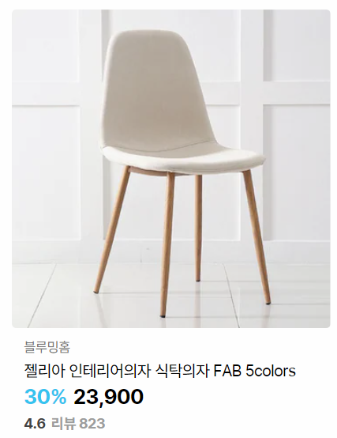

# 8/30

# [WEB] 웹 과정 📝

## **CSS 스타일링** 💭

- CSS 스타일을 입히기 위해서는 HTML 선택자가 필요

### HTML 기본구조 💡

- 웹 사이트 구성 요소

```html
<DOCTYPE html>
  <head>
    <body>
      <ul>
        <li>김밥</li>
        <li>배고파</li>
      </ul>
    </body>
  </head>
</DOCTYPE>
```

### span, div 💡

- 인라인 요소에 스타일을 따로 주고 싶을 때 사용

```html
<DOCTYPE html>
  <head>
    <body>
      <ul>
        <li>김밥</li>
        <li>
          <div class="class">배</div>
          고<span class="class2">파</span>
        </li>
      </ul>
    </body>
  </head>
</DOCTYPE>
```

### CSS 기본 스타일 💡

```CSS
"px":
모니터 해상도의 한 화소, 픽셀의 크기는 변하지 않기때문에 고정적인 단위

"%":
백분율 단위, 가변적인 레이아웃에 활용

"em":
상속의 영향을 받음, 배수 단위, 요소에 지정된 사이즈에 상대적인 사이즈를 가짐

"rem":
상속의 영향을 받지 않음, 최상위 요소의 사이즈를 기준으로 배수 단위를 가짐
```

```CSS
"vw":
vw 요소는 높이값의 100분의 1의 단위
예를 들어 브라우저 높이값이 900px일때 1vw는 9px이라는 뜻

"vh":
vh 요소는 높이값의 100분의 1의 단위
예를 들어 브라우저 높이값이 900px일때 1vh는 9px이라는 뜻

"vmin, vmax":
vmin과 vmax는 너비값과 높이값에 따라 최대, 최소값을 지정할 수 있음

"vh" : 1/100th of the height of the viewport.

"vw" : 1/100th of the width of the viewport.

"vmin" : 1/100th of the minimum value between the height and the width of the viewport.

"vmax" : 1/100th of the maximum value between the height and the width of the viewport.
```

### CSS 적용 우선순위(cascading order) 💡

```css
1. 중요도
2. 우선순위
    - 인라인 > id > class, 속성, pseudo-class > 요소, pseudo-element
3. CSS 파일 로딩 순서
```

### CSS 원칙 💡

```css
모든 요소는 네모(박스모델)이고,
위에서부터 아래로, 왼쪽에서 오른쪽으로 쌓인다.(좌측 상단에 배치)
```

### Box model 💡

```css
"margin" : 테두리 바깥의 외부 여백, 배경색 지정 x

"border" : 테두리 영역

"padding" : 테두리 안쪽의 내부 여백 요소에 적용된 배경색, 이미지는 padding까지 적용

"content" : 글이나 이미지 등 요소의 실제 내용
```

## **CSS Display** 💭

- CSS 원칙2

```css
display: block
-  줄 바꿈이 일어나는 요소
- 화면 크기 전체의 가로 폭을 차지한다.
- 블록 레벨 요소 안에 인라인 레벨 요소가 들어갈 수 있음

display: inline
- 줄 바꿈이 일어나지 않는 행의 일부 요소
- "content 너비만큼 가로 폭을 차지"
- width, height, margin-top, margin-bottom을 지정할 수 없다.
- 상하 여백은 line-height로 지정한다.
```

```css
대표적인 블록 레벨 요소:
div, ul, ol, li, p, hr, form 등

대표적인 인라인 레벨 요소:
span, a , img, input, b, em, i, strong 등
```

```css
display: inline-block
- block과 inline 레벨 요소의 특징을 모두 가짐
- "inline 처럼 한 줄에 표시할 수 있고, block처럼 width, height, margin 속성을 모두 지정할 수 있음"

display: none
- 해당 요소를 화면에 표시하지 않고, 공간조차 부여되지 않음
이와 비슷한 visibility: hidden은 해당 요소가 공간은 차지하나 화면에 표시만 하지 않는다.
```

# ✅ 실습

## 2일차 실습

# 실습 1

> 아래의 내용을 참고하여 만들어봅시다. 색상, 크기 및 문구는 변경 가능합니다.


## 상단 문구

- 상단 문구는 `h2` 태그를 활용하여 작성합니다.

- ALL ABOUT의 글씨 크기만 12px로 변경하고 줄바꿈을 합니다.

## 카드

- 카드들의 전체 영역의 너비는 900px입니다.

- 개별 카드 아이템(이미지 및 텍스트)의 너비는 300px입니다.

- 이미지는 `images` 폴더를 활용합니다.
- HTML

```html
<!DOCTYPE html>
<html lang="ko">
  <head>
    <meta charset="UTF-8" />
    <meta http-equiv="X-UA-Compatible" content="IE=edge" />
    <meta name="viewport" content="width=device-width, initial-scale=1.0" />
    <title>Document</title>
    <link rel="stylesheet" href="style.css" />
  </head>
  <body>
    <!-- 아래에 코드를 작성하세요. -->
    <div class="ALL-ABOUT">ALL ABOUT</div>
    <div class="MAIN-TITLE">BESPOKE 김치플러스 Infinite Line</div>
    <div>
      <ul>
        <div class="box">
          <div>
            <div>
              
              
              
            </div>
            <div class="소제목">
              <span class="소제목1">INSTALLATION</span>
              <span class="소제목2">INSTALLATION</span>
              <span class="소제목3">INSTALLATION</span>
            </div>
            <div class="제목">
              <span class="제목1">BESPOKE Infinite Line 단독 설치 가이드</span>
              <span class="제목2">BESPOKE Infinite Line 페어 설치 가이드</span>
              <span class="제목3">BESPOKE Infinite Line 단독 설치 가이드</span>
            </div>
            <div class="설명">
              <span class="설명1">내게 딱 맞는 조합과 컬러를 선택했지만,</span>
              <span class="설명2">내게 딱 맞는 조합과 컬러를 선택했지만,</span>
              <span class="설명3">내게 딱 맞는 조합과 컬러를 선택했지만,</span>
            </div>
            <div class="설명-2">
              <span class="설명-2-1"
                >우리 집 설치 공간과 맞을지 고민이라면 확인해보세요.</span
              >
              <span class="설명-2-2"
                >우리 집 설치 공간과 맞을지 고민이라면 확인해보세요.</span
              >
              <span class="설명-2-3"
                >우리 집 설치 공간과 맞을지 고민이라면 확인해보세요.</span
              >
            </div>
          </div>
        </div>
      </ul>
    </div>
    <div></div>
  </body>
</html>
```

- CSS

```css
/* 아래에 CSS를 작성해주세요. */
.ALL-ABOUT {
  text-align: center;
  font-size: x-large;
  font-weight: 500;
}
.MAIN-TITLE {
  text-align: center;
  font-size: xxx-large;
  font-weight: 800;
}

.box {
  align-content: center;
}

.img-단독 {
  height: 30rem;
  border-radius: 2rem;
  margin: 20px 15px;
}
.img-페어 {
  height: 30rem;
  border-radius: 2rem;
  margin: 20px 15px;
}

.마진 {
  margin: none;
}

.소제목 {
  font-weight: 800;
  color: gray;
}

.소제목1,
.소제목3 {
  margin: 30px;
}

.소제목2 {
  margin: 370px;
}

.제목 {
  font-size: x-large;
  font-weight: bolder;
}
.제목1,
.제목3 {
  margin: 28px;
}
.제목2 {
  margin: 40px;
}

.설명 {
  margin-top: 15px;
  color: gray;
}

.설명1,
.설명3 {
  margin: 28px;
}

.설명2 {
  margin: 197px;
}

.설명-2 {
  margin-top: 5px;
  color: gray;
}

.설명-2-1,
.설명-2-3 {
  margin: 28px;
}

.설명-2-2 {
  margin: 95px;
}
```


# 실습 2

> 아래의 내용을 참고하여 만들어봅시다. 색상, 크기 및 문구는 변경 가능합니다.



## 카드

- 카드의 너비는 300px입니다.

- 상품명은 `h3` 태그를 활용하며 나머지 모든 글씨는 자유롭게 활용합니다.
- HTML

```html
<!DOCTYPE html>
<html lang="ko">
  <head>
    <meta charset="UTF-8" />
    <meta http-equiv="X-UA-Compatible" content="IE=edge" />
    <meta name="viewport" content="width=device-width, initial-scale=1.0" />
    <title>Document</title>
    <link rel="stylesheet" href="style.css" />
  </head>
  <body>
    <!-- 아래에 코드를 작성하세요. -->
    <div></div>
    <div class="회사">블루밍홈</div>
    <h3 class="제품명">젤리아 식탁의자 FAB 5colors</h3>
    <div class="큰틀">
      <span class="할인율">30%</span><span class="가격">23,900</span>
    </div>
    <div class="큰틀2">
      <span class="평점">4.6</span><span class="리뷰">리뷰 823</span>
    </div>
  </body>
</html>
```

- CSS

```css
/* 아래에 CSS를 작성해주세요. */

.의자 {
  width: 300px;
  margin: 10px;
}
.회사 {
  margin: 0px 20px;
  color: gray;
  font-weight: bolder;
}

.제품명 {
  margin: 5px 19px;
}

.큰틀 {
  margin: 0px 17px;
}
.큰틀2 {
  margin: 5px 20px;
}

.할인율 {
  color: rgb(101, 183, 255);
  font-size: 1.7rem;
  font-weight: bolder;
}

.가격 {
  margin-left: 10px;
  font-size: 1.7rem;
  font-weight: bolder;
}

.평점 {
  font-weight: bold;
}

.리뷰 {
  margin-left: 10px;
  font-weight: bold;
  color: gray;
}
```


