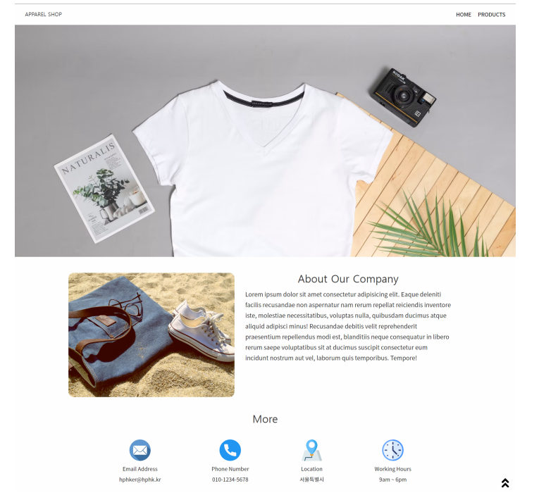
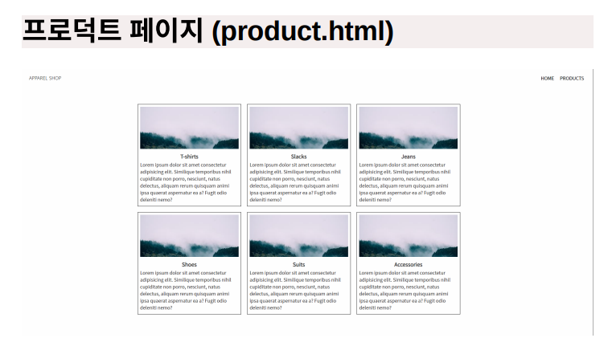

# 9/1

# [WEB] 웹 과정 📝

# ✅ 실습

### HTML Homepage코드

```html
<!DOCTYPE html>
<html lang="en">
<head>
  <meta charset="UTF-8">
  <meta http-equiv="X-UA-Compatible" content="IE=edge">
  <meta name="viewport" content="width=device-width, initial-scale=1.0">
  <link rel="stylesheet" href="css/_reset.css">
  <link rel="stylesheet" href="css/style.css">
  <title>HPHK APPAREL</title>
</head>
<body>
  <!-- navbar 항목 -->
  <nav class="navbar">
    <div class="navbar__logo">
      <i class="fas fa-blog"></i>
      <a href="">APPAREL SHOP</a>
    </div>
    <ul class="navbar__menu">
      <li><a href="index.html">HOME</a></li>
      <li><a href="products.html">PRODUCTS</a></li>
    </ul>
  </nav>
  <!-- main picture 항목 -->
  <div class="main">
  <div class="main-pic"></div>
  </div>
  <!-- about 항목 -->
  <div class="about">
    <div class="sub-pic"></div>
    <div>
      <div class="about-title">About Our Company</div>
      <div class="about-dis">Lorem ipsum dolor sit amet, consectetur adipisicing elit. Voluptate accusamus, magnam consequuntur nemo consequatur ut illo asperiores tempore magni sunt voluptatibus officiis temporibus pariatur explicabo dolorem minima nihil. Est, dolor. Lorem ipsum dolor sit amet consectetur, adipisicing elit. Rem, est repudiandae minima vero dolore ratione cumque natus! Nam eveniet excepturi veritatis nisi neque itaque placeat sunt eos molestias quas! Illum.</div>
    </div>
  </div>
  <!-- 하단 more -->
  <div class="More">More</div>
  <div class="address">
    <div class="more-box">
      <div>Email Address</div>
      <div>mhmh779@naver.com</div>
    </div>
    <div class="more-box">
      <div>Phone Number</div>
      <div>010-9135-2204</div>
    </div>
    <div class="more-box">
      <div>Location</div>
      <div>서울특별시</div>
    </div>
    <div class="more-box">
      <div>Working Hours</div>
      <div>9am-6pm</div>
    </div>
</body>
</html>
```

### HTML Products코드

```html
<!DOCTYPE html>
<html lang="en">
  <head>
    <meta charset="UTF-8" />
    <meta http-equiv="X-UA-Compatible" content="IE=edge" />
    <meta name="viewport" content="width=device-width, initial-scale=1.0" />
    <link rel="stylesheet" href="css/_reset.css" />
    <link rel="stylesheet" href="css/style.css" />
    <title>Shop Example</title>
  </head>
  <body>
    <nav class="navbar">
      <div class="navbar__logo">
        <i class="fas fa-blog"></i>
        <a href="">APPAREL SHOP</a>
      </div>
      <ul class="navbar__menu">
        <li><a href="index.html">HOME</a></li>
        <li><a href="products.html">PRODUCTS</a></li>
      </ul>
    </nav>
    <div>
      <div class="product-main">
        <div class="product-title">
          <div class="card">
            <div class="card-img">
              
            </div>
            <div class="card-title">T-shirts</div>
            <div class="card-dis">
              Lorem, ipsum dolor sit amet consectetur adipisicing elit. Vero
              culpa modi, corporis facere nobis doloribus error in voluptatibus
              hic nostrum deserunt nihil aspernatur ducimus natus possimus
              corrupti?
            </div>
          </div>
          <div class="card">
            <div class="card-img">
              
            </div>
            <div class="card-title">T-shirts</div>
            <div class="card-dis">
              Lorem, ipsum dolor sit amet consectetur adipisicing elit. Vero
              culpa modi, corporis facere nobis doloribus error in voluptatibus
              hic nostrum deserunt nihil aspernatur ducimus natus possimus
              corrupti?
            </div>
          </div>
          <div class="card">
            <div class="card-img">
              
            </div>
            <div class="card-title">T-shirts</div>
            <div class="card-dis">
              Lorem, ipsum dolor sit amet consectetur adipisicing elit. Vero
              culpa modi, corporis facere nobis doloribus error in voluptatibus
              hic nostrum deserunt nihil aspernatur ducimus natus possimus
              corrupti?
            </div>
          </div>
          <div class="card">
            <div class="card-img">
              
            </div>
            <div class="card-title">T-shirts</div>
            <div class="card-dis">
              Lorem, ipsum dolor sit amet consectetur adipisicing elit. Vero
              culpa modi, corporis facere nobis doloribus error in voluptatibus
              hic nostrum deserunt nihil aspernatur ducimus natus possimus
              corrupti?
            </div>
          </div>
          <div class="card">
            <div class="card-img">
              
            </div>
            <div class="card-title">T-shirts</div>
            <div class="card-dis">
              Lorem, ipsum dolor sit amet consectetur adipisicing elit. Vero
              culpa modi, corporis facere nobis doloribus error in voluptatibus
              hic nostrum deserunt nihil aspernatur ducimus natus possimus
              corrupti?
            </div>
          </div>
          <div class="card">
            <div class="card-img">
              
            </div>
            <div class="card-title">T-shirts</div>
            <div class="card-dis">
              Lorem, ipsum dolor sit amet consectetur adipisicing elit. Vero
              culpa modi, corporis facere nobis doloribus error in voluptatibus
              hic nostrum deserunt nihil aspernatur ducimus natus possimus
              corrupti?
            </div>
          </div>
        </div>
      </div>
    </div>
  </body>
</html>
```

### CSS 코드

```css
@import url("https://fonts.googleapis.com/css2?family=Noto+Sans+KR&display=swap");

body {
  font-family: "Noto Sans KR", sans-serif;
  min-width: 1280px;
  color: #333333;
}

a {
  text-decoration: none; /* 링크 밑줄 없애기 */
  color: black;
}
a:hover {
  color: #bc6c25;
  font-size: 1.3rem;
  transition: 0.2s;
}

li {
  padding: 10px;
}

.navbar {
  font-size: larger;
  display: flex;
  justify-content: space-between; /* 양쪽 정렬 */
  align-items: center; /* 위아래 정렬 */
  border-top: 2px solid #000000; /* 위에 선추가 */
  padding: 8px 40px; /* 패딩으로 간격 */
  margin-top: 30px;
}

.navbar__menu {
  list-style: none; /* 구분점 없애기 */
  display: flex;
}

.main {
  width: 1280px;
  justify-content: center;
}

.main-pic {
  display: flex;
  position: relative;
  width: 1200px;
  height: 250px;
  margin: 20px 150px 30px;
}

.picture {
  position: absolute;
  top: 0px;
  bottom: 0px;
  width: 100%;
  height: 100%;
  object-fit: cover;
  border-radius: 10px;
}

.about {
  display: flex;
  justify-content: center;
}

.sub-pic {
  position: relative;
  width: 400px;
  height: 300px;
}

.about-title {
  display: flex;
  justify-content: center;
  align-items: center;
  font-size: 1.4rem;
  font-weight: bold;
  height: 50px;
}

.about-dis {
  height: 250px;
  width: 500px;
  display: flex;
  justify-content: left;
  margin: 20px;
  text-align: center;
  line-height: 30px;
}

.More {
  font-size: 28px;
  height: 2rem;
  display: flex;
  justify-content: center;
  margin: 25px;
}

.address {
  height: 100px;
  display: flex;
  justify-content: space-evenly;
  margin-bottom: 100px;
}

.more-img {
  width: 64px;
  height: 64px;
  display: flex;
  margin-top: 40px;
  margin-bottom: 10px;
}

.more-box {
  display: flex;
  flex-direction: column;
  justify-content: center;
  align-items: center;
  line-height: 1.5rem;
  width: 200px;
}

.product-main {
  display: flex;
  justify-content: center;
  align-items: center;
  height: 1000px;
  margin-top: 100px;
}

.product-title {
  display: flex;
  flex-flow: row wrap;
  justify-content: center;
  align-items: center;
  height: 850px;
  width: 1280px;
}

.card {
  height: 400px;
  width: 400px;
  border: 2px solid #000000;
  margin: 0px 10px;
  border-radius: 15px;
}

.card-img {
  display: flex;
  justify-content: center;
  align-items: center;
  height: 180px;
  width: 380px;
  margin: 5px 10px;
  border-radius: 15px;
}

.card-title {
  display: flex;
  justify-content: center;
  font-size: x-large;
  font-weight: bolder;
  margin-top: 15px;
}

.card-dis {
  display: flex;
  justify-content: center;
  align-items: center;
  font-size: large;
  line-height: 1.8rem;
  height: 180px;
  margin: 0px 10px;
}
```

## 📑 만들어야 하는 페이지




## 🔎 내가 만든 페이지


## 💎 느낀점

- 시멘틱 구조를 잘 짜야 고생하지 않는다는 점을 꺠달았다.
- 전체적으로 어떻게 페이지를 구성할지 구상하고 시작하기
- 가로, 세로의 길이를 개발자 도구로 확인하여 비율을 맞춰야 한다.
- class name에 대한 고민, 정확하게 선택자를 이용해서 CSS 스타일을 적용해야 한다.😂
