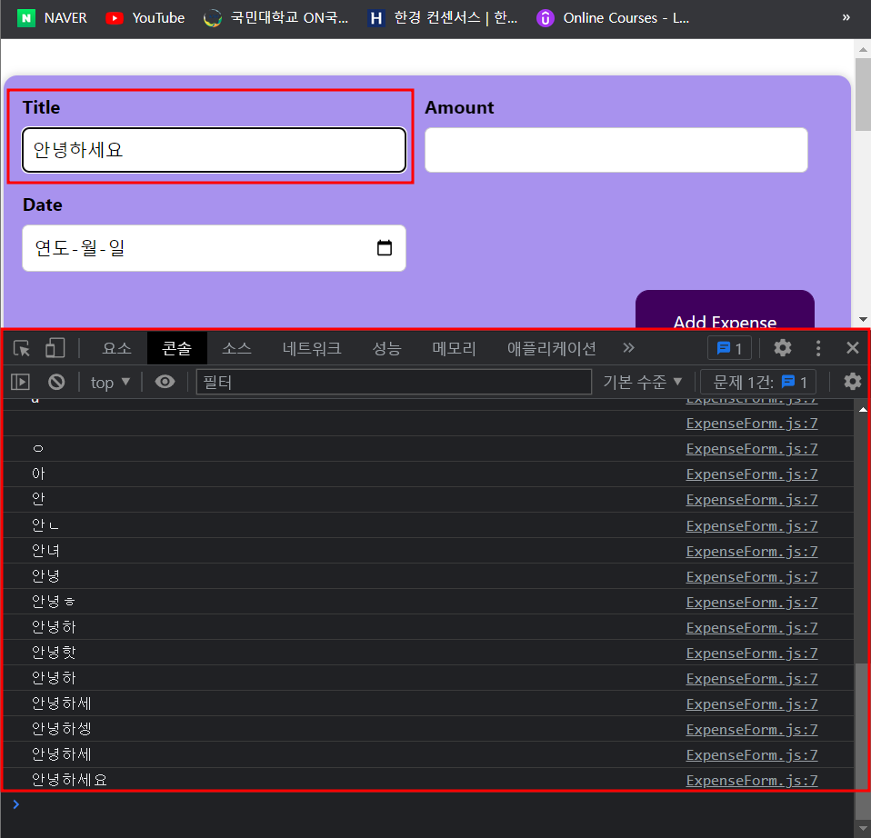

# 9/25

# [React] React Quick Start 📝

## **React의 Event사용** 💭

- React도 JS와 같이 Event를 다룰 수 있음

### Event.target.value 💡

- 직접 작성한 코드

```js
const ExpenseForm = () => {
  const titleChangeHandler = (event) => {
    console.log(event.target.value);
  };

  return (
    <form>
      <div className="new-expense__controls">
        <div className="new-expense__control">
          <label>Title</label>
          <input type="text" onChange={titleChangeHandler} />
        </div>
        <div className="new-expense__control">
          <label>Amount</label>
          <input type="number" min="0.01" step="0.01" />
        </div>
        <div className="new-expense__control">
          <label>Date</label>
          <input type="date" min="2022-01-01" max="2023-12-31" />
        </div>
      </div>
      <div className="new-expense__actions">
        <button type="submit">Add Expense</button>
      </div>
    </form>
  );
};
```

- 아래와 같이 input에 onChange를 걸어서 {titleChangeHandler}를 일치시키고, event.target.value를 출력하면 유저가 input값을 입력할때마다 출력됨.
  

- 만약에 값을 저장하고 싶다면 useState를 사용 하기
