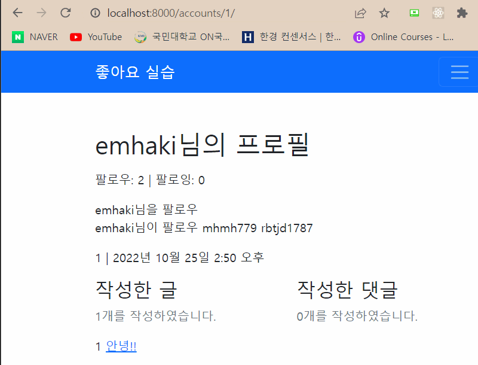

# 10/25

# [목차]📝

[1. [M:N]](#mn)

[2. 팔로잉 기능구현 이론](#팔로잉-기능구현-이론)

[3. 팔로잉 기능구현 실습](#팔로잉-기능구현-이론)

<br>

## M:N

- ManyToManyField
- 연관있는 모델을 연결
- 재귀적인 self를 사용
- MTM Field는 symmetrical(대칭)일 것을 가정

```py
class User(AbstractUser):
  # A가 B를 팔로잉, 이 것은 서로 친구 X(symmetrical=False)
  followings = models.ManyToManyField('self', symmetrical=False, related_name = 'followers')

# 팔로잉 기능 구현

사용자 프로필 페이지에 들어가서
팔로우 상태가 아니면 '팔로우'를 누르면 추가(add)
팔로우 상태이면, '팔로우 취소'버튼을 누르면 삭제(remove)

팔로우/취소 요청을 할 때 URL은 어떻게할까?
/accounts/<int:pk>/follow/
처리 완료 후에는 프로필 페이지로 redirect

(추가사항)
셀프 좋아요는 허용이지만
셀프 팔로우는 허용할 수 없다.
```

## 팔로잉 기능구현 이론

```py
# accounts/ urls.py
path('<int:pk>/follow/', views.follow, name="follow")

# detail.html
a 링크  팔로우
# view.py
@login_required
def follow(request, pk):
  User == get_user_model() # get_user_model 사용하기
  user = get_user_model().objects.get(pk=pk)
  if request.user == user:
    messages.warning(request, '스스로 팔로우 할 수 없습니다.')
    return redirect('accounts:detail', pk)

  if request.user in user.followers.all() # 있으면 삭제
    user.followers.remove(request.user)
  # 팔로우 상태이면, '팔로우 취소'버튼을 누르면 삭제(remove)
  else: # 없으면 추가
  # 팔로우 상태가 아니면 '팔로우'를 누르면 추가(add)
    user.followers.add(request.user)

  return redirect('accounts:detail', pk)

# 에러 띄우기
# get은 없을때 오류를 내주기 때문에 get_object_or_404를 사용해야함
article = get_object_or_404(Article, pk=pk)
```
<br>


## 팔로잉 기능구현 실습


```py
1. model
User모델에서 followings = models.ManyToManyField('self', symmetrical=False, related_name = 'followers')로 변경

2. url.py
urls.py에서 path('<int:pk>/follow/', views.follow, name='follow')로 variable routing 설정

3. views.py
def follow(request, pk):
  user = get_object_or_404(get_user_model(), pk=pk)
  if request.user == user:
    messages.warning(request, "스스로 팔로우 할 수 없습니다.")
    return redirect('accounts:detail')

  if request.user in user.followers.all():
    user.followers.remove(request.user)
  else:
    user.followers.add(request.user)
로 함수를 정의해서 로그인한 유저와 팔로우 버튼을 누른 유저가 같다면 경고창을, 다르고 DB에 없다면 request.user를 DB에 추가, request.user가 DB에 있다면 삭제하도록 구현

4. HTML

4-1 숫자

 로 팔로잉과 팔로워 숫자를 count하고
가 다르다면
를 전송하는 a태그
에 user가 있다면
팔로우 취소를 보여주고 없으면 팔로우가 보이게끔 설정

4-2 목록
# views.py
def detail(request,pk):
  user = get_user_model().object.get(pk=pk)
  # user = get_object_or_404(get_user_model(), pk=pk) 가 더 바람직
  indexs = user.followers.all()
  followings = user.followings.all()
# detial.html
 {{ index.username }} 
로 user.username을 팔로우 하는 명단을 출력
 {{ following.username }} 
로 user.username이 팔로우하고 있는 사람을 출력
```